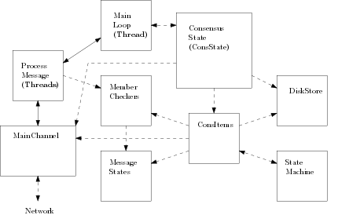
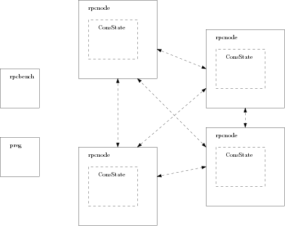

### Note this is an experimental project for experiments only.

The intention of this project is to test Byzantine fault tolerate consensus algorithms
and broadcasts and ways of scaling them.
It (currently) focuses on algorithms that do no require synchrony
for correctness, and tolerate up to 1/3 of Byzantine faults.
This is a hobby project so things will change and be added/removed/fixed/broken and undetermined intervals.
Other than dependent cryptographic libraries it is built from
scratch using Golang and standard libraries.

**This project is not meant to measure "transactions per second",
or say that one solution is better than another. It is for investigating
different ideas in a wide range of situations.**

The structure of the project is designed so that consensus
algorithms will be relatively small in terms of line of code, with the *general code* handling most of the work.

The general code takes care of things like: networking,
tracking membership, checking signatures, scaling mechanisms, ensuring progress and recovery after faults of the network or nodes, helping slow nodes catch up, disk storage, etc.

The idea is to allow many different algorithms to be able to be run
in many different settings.
Note that techniques are used from various papers, but they
may not follow the algorithms of the papers exactly, and
instead just take key ideas in ways that can be 
implemented in this project.

The readme and associated godocs give a highlevel overview,
but they are quite spotty.
Eventaully results will be written up more clearly in technical reports.
Some initial results can be found here:
https://arxiv.org/abs/2004.09547

## Overview of implemented algorithms/configurations

- [Consensus algorithms](notes/consalgorithms.md) - binary consensus, multivalue consensus, reliable broadcasts
- [Cryptography](notes/cryptography.md) - signatures, encrpyted/authenticated channels, threshold signatures,
multisignatures, VRFs
- [State machines](notes/statemachines.md) - counter, random bytes, transactions, assets
- [Total/causal ordering](notes/ordering.md) - different consistency requirements
- [Ways of scaling](notes/scaling.md) - different broadcasts, using multi/threshold signatures, randomized mebmer selection

See the godoc for more details (in progress).

## Consensus node structure



The main code components of a consensus node are as follows:
- MainChannel - This is were the networking code is. It handles connections and sends and receives messages from the network.
- MemberCheckers - Each instance of consensus has a member checker. Basically this keeps track of the set of public keys that are considered to be the members of the current consensus instance. It ensures messages only come from valid members and are signed properly. It needs to be concurrent safe. Members may change from one consensus instance to the next as given by the configuration/consensus/state machine.
- MessageStates - Each instance of consensus has a message state. This keeps track of information about messages received for the consensus. Some of its functionality includes dropping duplicates, and keeping track of how many of each message type has been received. It needs to be concurrent safe.
- ConsensusState/CausalConsensus state
  - (ConsState) - This is the core set of code that keeps track of what consensus instances are currently running, starts new instances, garbage collects old instances, storing things to disk, and takes care of recovery in case of faulty networks or nodes.
- ConsItems - This is the where the code for the consensus algorithm exists.
- StateMachine - This is where the application lives, it gives inputs as proposals to consensus and receives decided values.
- DiskStore - This is where decided values are stored to disk and loaded as needed. It acts like an append only log indexed in memory. If a node is shut down or restarted, the state will be replayed from disk (if enabled in the configuration) before joining back in the consensus and recovering any missing values.

The main threads of execution are as follows:
- ProcessMessage Threads - These are a set of threads running that take care of the initial message processing. This includes deserialization, validity check, membership check, signature check, duplicate check, etc... Once this is done the messages are passed to the main loop.
- MainLoop - This is the sequential processing of the processed messages that runs the steps of the consensus algorithm itself. The idea is that all the heavy work is done by the process message threads, then the state transitions of the consensus algorithm itself take place here in a sequential fashion.
- (There are also some networking threads responsible for sending and receiving messages).

#### Also read
- Some additional notes [INFO.md](INFO.md)
- **Some additional issues** [TOFIX.md](TOFIX.md)
- Some additional things to add/improve [TOADD.md](TOADD.md)

# Install

**To run benchmarks on Google cloud compute you just need to
clone the project and run scripts as described (see section at bottom of Readme)**

### Basic install
This allows you to just run the unit tests.
- Install go and setup paths.
- If you want to use quantum safe crypto install liboqs - see: https://github.com/open-quantum-safe/liboqs-go
- Clone this project to the folder ```$GOPATH/src/github.com/tcrain/```.

### Full install
See the dockerfile: [Dockerfile](docker/build/Dockerfile).
This shows how to install everything and configure the nodes on a Debian image with golang.

## To run unit tests:

```go test -v -timeout=30m ./...```

The timeout is large because some of the tests take a long time
Note that for some of these tests signature validations are replaced
by sleeps as to not overstress the computer. This can be disabled
using the ``TestSleepValidate`` option in [config.go](config/config.go).


## Benchmark Setup



The image above shows a benchmark configuration with 4 consensus nodes.
Each solid box represents a different process (usually run on a seperate physical machine).

Currently benchmarks are run as follows:
1. Launch a set of nodes, wait for them to get setup.
2. Start all nodes.
3. Nodes run a fixed number of consensus instances.
4. Collect and print results.

More complex benchmarks with clients and different state machines are in development.

The main binaries used for running the benchmarks (found in [cmd/](cmd/)):
- rpcnode - This starts an rpc server listening for commands to start consensus nodes. A single rpcnode binary may run multiple consensus nodes, running of different ports. The *ConsState* runs the *Consensus node structure* described in the previous section.
- preg (Participant register) - This starts an rpc server listening for commands for consensus nodes to register themselves as participants, and get the list of other participants.
- rpcbench - This runs the bench. It connects to the rpc nodes, telling them to setup consensus nodes, tells them to start, collects the results, and shuts down the nodes.

### Benchmark configurations

General configuration options can be found in [config/config.go](config/config.go).
Be sure to update the timeouts in the configuration depding on the size and latencies of your benchmarks.

Each benchmark takes as input a json file that gives the configuration to run.
The file describes the parameters of the object
[consensus/types/testoptions.go](consensus/types/testoptions.go). **Note that some configuration options are types described by ints, so you have to use the int that describes the option and not the string in the file.**

## To test rpc locally
This will run a test like it is over the network, but just on the local node, using loopback.

```./bench_example.sh```

This will run the configuration files in [testconfigs/][testconfigs/].

## To run a local benchmark

This is mainly just to check things are working before running
benchmarks over the network.

First create some configurations:
- The test configurations that will be run have to be coded in the
[gento.go](../cmd/gento/gento.go) main function.
See that file for examples, but the basic idea is that a set of folders will be created
within the [testconfigs](../testconfigs/) folder.
Each folder will contain a set of json files of encoded Testoptions
objects each describing a benchmark. Each folder will also contain a
`gensets` folder which will describe how the benchmark results graphs
will be generated.
- Now to run a binary consensus benchmark locally run:
``./scripts/Bench.sh 127.0.0.1 "{foldername}" "" "{nodecount}" none ipfile none 4534 0``
Where ``{foldername}`` is the name of the folder with the test configurations generated in the previous step
and ``{nodecount}`` is the number of consensus nodes (processes) that will run the benchmark.
It can be a list with each element containing 1, 2, or 3 integers.
The first is the total number of nodes (see NumTotalProcs in testoptions.go),
The second is the network fan out if gossip is enabled (see FanOut in testoptions.go).
The third is the number of the random members used (see RndMemberCount in testoptions.go).
- The results can be found in ```./benchresults/```

## To run benchmarks on Google Cloud Compute

- [Google cloud bench](notes/cloudbench.md)
- Some informal [notes](notes/cloud.md) about running on google cloud 
